# Docker Bootcamp

## Getting Started

1. [Docker for Windows](https://docs.docker.com/docker-for-windows/install/)
1. Hello World
   ```cmd
   docker run hello-world
   ```
   - You don't have the hello-world image locally, so it reaches out to docker hub
     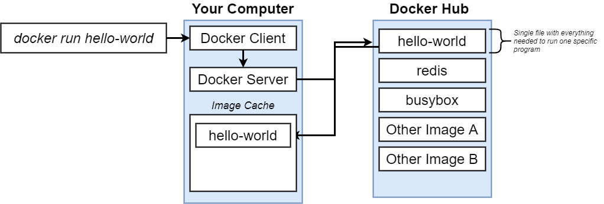
1. How does it work on a system?
   

   - EVERY image is running on a linux VM

# Docker CLI

## Simple Hello World

```ps
docker run hello-world
```

## Command Override

1. Definition
   ```
   docker run <image-name> <command>
   ```
1. Print
   ```
   docker run busybox echo hi there
   ```
1. Listing unix folders inside a container
   ```
   docker run busybox ls
   ```
   - The echo commands exist inside the busybox image
   - They do NOT exist in the hello-world image
1. Doesn't work
   ```
   docker run hello-world echo hi
   ```
   - Commands are limited by the image

## List All Images on Machine

1. Command
   ```
   docker ps
   ```
1. Busybox and hello-world are in general short running containers
1. This will keep busybox running
   ```
   docker run busybox ping google.com
   ```
   ```
   docker ps
   ```
   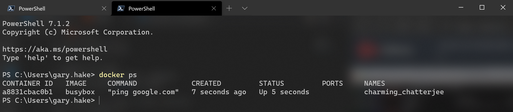
1. This is a good command to remember if you need to grab image ids

## List All Images Ever Created

1. Command
   ```
   docker ps --all
   ```
1. Which introduces the idea of a container life cycle
   - When does a container get shut down
   - Why does a container get shut down
   - What happens when it does

**docker run = docker create + docker start**

## Docker Create and Docker Start

1. Docker Create
   ```
   docker create hello-world
   ```
1. You'll get a long string like so:
   ```
   f7b241874c91443af5c22f3f4fd3de79e397ce4118c9c2d532d80adb33039cc9
   ```
   - Container id
1. Docker Start
   ```
   docker start -a f7b241874c91443af5c22f3f4fd3de79e397ce4118c9c2d532d80adb33039cc9
   ```
   - What does the `-a` get you?
   - Makes docker wait for output and prints it out to terminal
   - Docker start will not show you output by default
1. Restart a container
   ```
   docker run busybox echo hi there
   ```
   ```
   docker ps --all
   ```
   - Grab the id
   ```
   docker start -a <id>
   ```
   - You'll notice it showed 'hi t here'
   - You cannot replace the default command of a container once it's created
   - Can only start it and it will run that default command

## Clear Downloaded Containers

1. Show all containers
   ```
   docker ps --all
   ```
1. Remove all
   ```
   Docker system prune
   ```
1. Deletes cache as well as downloaded images
   - Will need to be re-cached (takes some time)

## Retrieving Log Outputs

1. Command
   ```
   docker logs <id>
   ```
1. Creating container to get logs
   ```
   docker create busybox echo hi there
   ```
   - Get the id
   ```
   docker start <id>
   ```
   ```
   docker logs <id>
   ```
1. Getting logs does NOT re-run the container
   - Simply gets all the logs emtted by the container
   - Much faster than re-running

## Stopping Containers

1. Create long running container
   ```
   docker create busybox ping google.com
   ```
   ```
   docker start <id>
   ```
1. See running image
   ```
   docker ps
   ```
1. So how do we stop this container?
1. Docker stop
   ```
   docker stop <id>
   ```
   - Gives the container 10 seconds to gracefully stop
1. Docker kill
   ```
   docker kill <id>
   ```
   - Shut down right now, no cleanup

## Multi Command Containers

1. The idea is that you will run containers that will have cli's within them
   - Servers, databases, etc
1. Redis is a server w/ it's own cli
   - You can run redis specific commands
1. Can we run this redis specific commands on a redis container?
   ```
   docker run redis
   ```
   - Eventually should see: `* Ready to accept connections`
1. How do we run commands in a container?
   ```
   docker exec -it <id> <command>
   ```
1. In a new terminal window
   ```
   docker exec -it <id> redis-cli
   ```
1. What is the `-it` flag
   - Two flags really, `-i` and `-t`
   - `-i` ties terminal to STDIN of image
   - `-t` makes input and output easy to read and gives 'intellisense'

## Getting Command Prompt In Container

1. Open a shell in a context of a container
   ```
   docker exec -it <id> sh
   ```
1. ctrl-c or ctrl-d to exit
   - I've found that ctrl-c does not kill the shell
1. Starting w/ a shell
   ```
   docker run -it busybox sh
   ```

# Building a Custom Image

## Docker Build

```Dockerfile
# Use an existing docker image as a base
FROM alpine

# Download and install a dependency
RUN apk add --update redis

# Tell the image what to do when it starts
# as a container
CMD [ "redis-server" ]
```

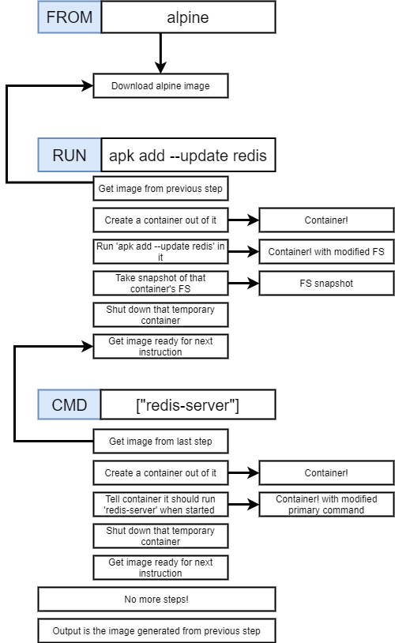

1. After building your custom Dockerfile

   - Open terminal in folder where Dockerfile exists

   ```
   docker build .
   ```

   - You'll get an id after creation

   ```
   docker run <id>
   ```

1. What is the `.`?
   - Build context
   - More to come
1. Big takeaway
   - Every step in the Dockerfile creates a temporary image
   - Runs a command in that image (an image can have only one default command)
   - Next step uses previous image as 'starting point'

## Rebuilds with Cache

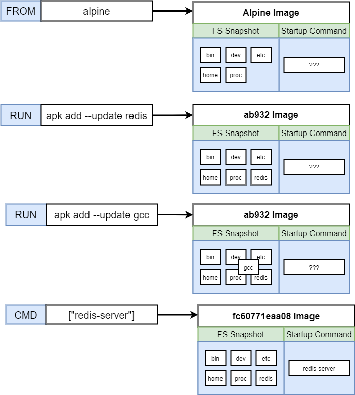

1. If you rebuild a Dockerfile and it has steps that it's ran before, it will use the cache of the previous run
1. In the above image, step 3 is new, so it uses cache values for everything else
   - It will create new images from the introduction of the new instruction
   - This is true if you reorder steps!

## Tagging an Image

1. Needing to know the id of an image to run it is annoying
   ```
   docker build -t <dockerid>/<repo/project>:<version> .
   ```
   ```
   docker build -t eventhorizn/redis:latest .
   ```
   ```
   docker run eventhorizn/redis
   ```
1. The version at the end is the tag technically
1. Whole process is called tagging though

## Manual Image Generation with Docker Commit

1. You create a container from an image, but
1. You can also create an image from a container
   ```
   docker run -it apline sh
   ```
   ```
   /# apk add --update redis
   ```
   - Open a new terminal
   ```
   docker ps
   ```
   - Get id
   ```
   docker commit -c "CMD 'redis-server'" <id>
   ```
   ```
   docker run <new id>
   ```

# Making a Real Project

1. We first tried creating a docker image for node w/ just the 'alpine' image
   - But node and npm is not installed on it
1. The issue is that 'alpine' is a term in Docker for 'as small as possible'
1. The image we want to use is in the 'Node' repository
   - But we still want the 'alpine' tag
   - Because it's the smallest version of that image
1. Running the node image just w/ `docker run <id>` will not work
   - We need to do port forwarding
1. Port forwarding is only something we do when running a container
   ```
   docker run -p 8080:8080 <id>
   ```
   - Ports from and to do NOT have to be identical
   ```
   docker run -p 5000:8080 <id>
   ```
1. So, what happens when you update a file and want to reflect that change in an image?

   - We can't do hot reloading, so we have to rebuild the image
   - With node, in order to keep it from re-running npm install and re-installing all of your node packages

   ```
   FROM node:alpine

   WORKDIR /usr/app

   # Copy everything from local working directory to container's
   COPY ./package.json ./
   RUN npm install

   COPY ./ ./

   CMD ["npm", "start"]
   ```

   - We first copy the package.json
   - Then run the install
   - Then copy everything else
   - Will use the cache for package files

1. Separate out copy steps when you can so reloading is faster

# Docker Compose

1. Why would we need multiple containers that are part of the 'same app'
   - Node app in one container
   - Redis in another
1. All about scalability
   - If your app got popular, you'd want many images for your node server, and one for redis
1. This is why we wouldn't put node and redis in the same image!
   - All node images would point to same redis image
1. How do we connect two images together?
   - CLI has networking commands that are a pain to use
   - Docker Compose

## What is Docker Compoose?

1. Separate CLI that is installed w/ Docker
1. Used to start up multiple Docker containers at the same time
1. Automates some of the long-winded arguments we were passing to docker run
1. Wrapper on Docker CLI that simplifies things
1. Just by including your images in the same docker-compose file, they will be networked together
1. docker-compose.yml
   ```yml
   version: '3'
   services:
   redis-server:
     image: 'redis'
   node-app:
     build: .
     ports:
       - '4001:8081'
   ```

## Docker Compose Commands

1. Docker run myimage
   ```
   docker-compose up
   ```
1. Docker build . + docker run myimage
   ```
   docker-compose up --build
   ```
1. Stop Containers
   ```
   docker-compose down
   ```
1. Container Status
   ```
   docker-compose ps
   ```
   - Looks for Docker-compose.yml file
   - Will return status of images in that file
1. In general, you need to run docker compose commands w/i the directory w/ the docker-compose.yml file

## Restarting a container

1. Restart policies
   - "no"
     - Needs quotes
     - In yaml, no = false
   - always
   - on-failure
   - unless-stopped
1. In dockerfile
   ```yml
   version: '3'
   services:
   redis-server:
     image: 'redis'
   node-app:
     restart: always
     build: .
     ports:
       - '4001:8081'
   ```

# Create a Production Workflow

1. Create an app
   - [Link](https://create-react-app.dev/docs/getting-started/#npx)
   - Creating 'frontend' app
1. Create a dev dockerfile
   - Dockerfile.dev
   - How to run build on this file?
   ```ps
   docker build -f Dockerfile.dev
   ```
1. Running the react image
   ```ps
   docker run -p 3000:3000 IMAGE_ID
   ```
1. Back to the issue of propogating code changes to our container
   - Docker Volumes
   - We set up a 'reference' to our source code instead of copying
   ```
   docker run -p 3000:3000 -v /app/node_modules -v $(pwd):/usr/app <id>
   ```
   - -v /usr/app/node_modules
     - Needed as there's no node_modules on local machine to map to
   - $(pwd) = present working directory
     - Map pwd to /usr/app
     - Colon says 'map something outside container to something inside'
1. I was runningn issues running the Docker commands

## Using Docker Compose

```yml
version: '3'
services:
  web:
    stdin_open: true
    environment:
      - CHOKIDAR_USEPOLLING=true
    build:
      context: .
      dockerfile: Dockerfile.dev
    ports:
      - '3000:3000'
    volumes:
      - /app/node_modules
      - .:/app
```

1. Much easier to define what's happening
1. I actually worked when the docker commands above didn't
1. Should we keep the copy in the Dockerfile?
   - It's best to keep it even if we are referencing the files on the local machine and not the container

## Attaching Test Suite

1. There are two options
1. First is to run the docker image above and do a `docker exec` command to attach another docker image to it
1. The second is to create a new environment on the docker compose file to run tests
   - No interaction (which is fine)

```yml
version: '3'
services:
  web:
    stdin_open: true
    environment:
      - CHOKIDAR_USEPOLLING=true
    build:
      context: .
      dockerfile: Dockerfile.dev
    ports:
      - '3000:3000'
    volumes:
      - /app/node_modules
      - .:/app
 tests:
    stdin_open: true
    build:
      context: .
      dockerfile: Dockerfile.dev
    volumes:
      - /app/node_modules
      - .:/app
    command: ['npm', 'run', 'test']
```

## Multi-Step Build Process

1. For production, we build our node app, and need to host it on a production server
   - Nginix
1. How do we set that up?
   - Build portion needs a node base image
   - Run portion needs an ngnix base image
1. We develop a 'multi-step' build process
1. Has muiltipe phases
   - Build Phase
   - Run Phase

# Deployment with AWS and TravisCI: docker-react

1. [Standalone Project](https://github.com/eventhorizn/docker-react)

## Initial Setup

1. Go to AWS Management Console
1. Search for Elastic Beanstalk in "Find Services"
1. Click the "Create Application" button
1. Enter "docker" for the Application Name
1. Scroll down to "Platform" and select "Docker" from the dropdown list.
1. Change "Platform Branch" to Docker running on 64bit Amazon Linux
1. Click "Create Application"
1. You should see a green checkmark after some time.
1. Click the link above the checkmark for your application. This should open the application in your browser and display a Congratulations message.

## Change from Micro to Small instance type:

- You may not need to do this
- Note that a t2.small is outside of the free tier. t2 micro has been known to timeout and fail during the build process.

1. In the left sidebar under Docker-env click "Configuration"
1. Find "Capacity" and click "Edit"
1. Scroll down to find the "Instance Type" and change from t2.micro to t2.small
1. Click "Apply"
1. The message might say "No Data" or "Severe" in Health Overview before changing to "Ok"

## Add AWS configuration details to .travis.yml file's deploy script

1. Set the region. The region code can be found by clicking the region in the toolbar next to your username.
   - eg: 'us-east-1'
1. app should be set to the Application Name (Step #4 in the Initial Setup above)
   - eg: 'docker'
1. env should be set to the lower case of your Beanstalk Environment name.
   - 'docker-env'
1. Set the bucket_name. This can be found by searching for the S3 Storage service. Click the link for the elasticbeanstalk bucket that matches your region code and copy the name.
   - 'elasticbeanstalk-us-east-1-923445599289'
1. Set the bucket_path to 'docker'
1. Set access_key_id to $AWS_ACCESS_KEY
1. Set secret_access_key to $AWS_SECRET_KEY

## Create an IAM User

1. Search for the "IAM Security, Identity & Compliance Service"
1. Click "Create Individual IAM Users" and click "Manage Users"
1. Click "Add User"
1. Enter any name you’d like in the "User Name" field.
   - eg: docker-react-travis-ci
1. Tick the "Programmatic Access" checkbox
1. Click "Next:Permissions"
1. Click "Attach Existing Policies Directly"
1. Search for "beanstalk"
1. Tick the box next to "AWSElasticBeanstalkFullAccess"
1. Click "Next:Tags"
1. Click "Next:Review"
1. Click "Create user"
1. Copy and / or download the Access Key ID and Secret Access Key to use in the Travis Variable Setup.

## Travis Variable Setup

1. Go to your Travis Dashboard and find the project repository for the application we are working on.
1. On the repository page, click "More Options" and then "Settings"
1. Create an AWS_ACCESS_KEY variable and paste your IAM access key from step #13 above.
1. Create an AWS_SECRET_KEY variable and paste your IAM secret key from step #13 above.

## Deploying App

1. Make a small change to your src/App.js file in the greeting text.
1. In the project root, in your terminal run:
   ```
   git add.
   git commit -m “testing deployment"
   git push origin master
   ```
1. Go to your Travis Dashboard and check the status of your build.
1. The status should eventually return with a green checkmark and show "build passing"
1. Go to your AWS Elasticbeanstalk application
1. It should say "Elastic Beanstalk is updating your environment"
1. It should eventually show a green checkmark under "Health". You will now be able to access your application at the external URL provided under the environment name.

## Cleanup

1. We don't want to pay (unless we do)
1. Go to the Elastic Beanstalk dashboard.
1. In the left sidebar click "Applications"
1. Click the application you'd like to delete.
1. Click the "Actions" button and click "Delete Application"
1. You will be prompted to enter the name of your application to confirm the deletion.

# Building a Multi-Container Application

## Application Architecture

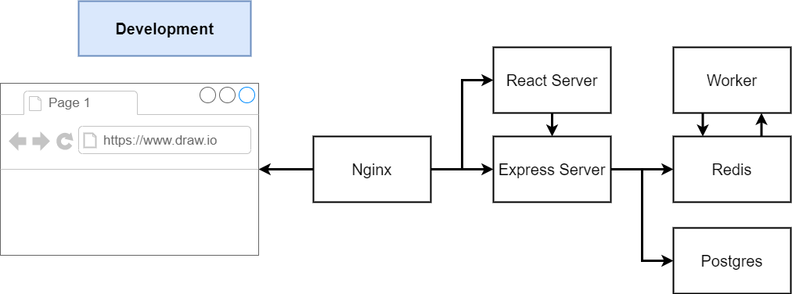

## Application Flow

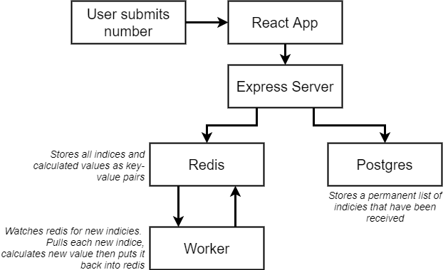

## Routing

1. We are using nginx to route things correctly
1. We have a react server and an express server
1. We want to route specific endpoints a specific server

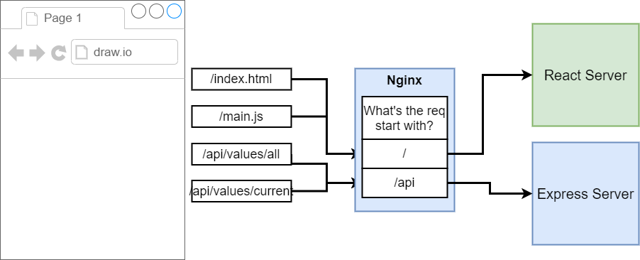

## Deployment

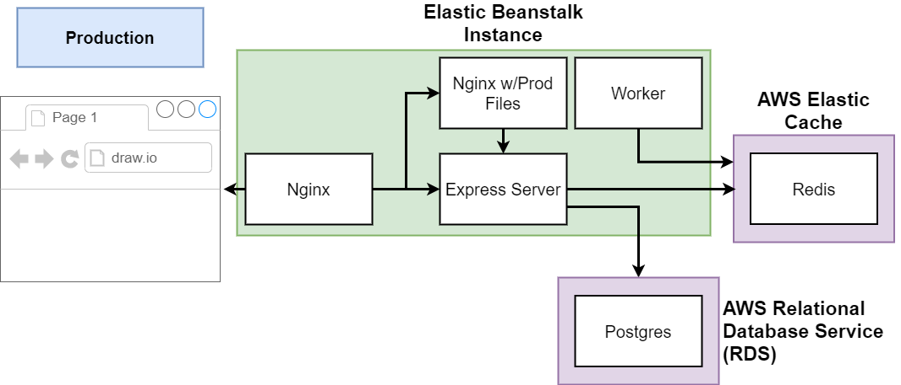

1. [Standalone Project](https://github.com/eventhorizn/docker-multi)
   - This is the project that was setup to hook into TravisCI and AWS
1. Inside you'll notice a Dockerrun.aws.json
   - Works similarly to the docker-compose.yml
1. We used TravisCI in this project to push images to DockerHub
   - We will pull those images in the aws.json file when deploying
1. Elastic Beanstalk uses Amazon ECS (Elastic Container Service) to run images
   - [Amazon ECS Task Definition](https://docs.aws.amazon.com/AmazonECS/latest/developerguide/task_definitions.html)
1. We really care about [Container Definitions](https://docs.aws.amazon.com/AmazonECS/latest/developerguide/task_definition_parameters.html#container_definitions)
   - Get a better understanding of what we are writing in the aws.json file
1. We are using Managed Data Service Providers for Redis and Postgres
1. AWS Elastic Cache for Redis
   - Automatically creates and maintains Redis instances
   - Super easy to scale
   - Built-in Logging and Maintenance
   - Security is brtter
   - Easier to Migrate Off of EB
1. AWS Relational Database Service
   - All the same as Elastic Cache plu
   - Automated Backups and Rollbacks

# Deployment with AWS and TravisCI: docker-multi

## EBS Application Creation

1. Go to AWS Management Console and use Find Services to search for Elastic Beanstalk
1. Click “Create Application”
1. Set Application Name to 'multi-docker'
1. Scroll down to Platform and select Docker
1. In Platform Branch, select Multi-Container Docker running on 64bit Amazon Linux
1. Click Create Application
1. You may need to refresh, but eventually, you should see a green checkmark underneath Health.

## RDS Database Creation

1. Go to AWS Management Console and use Find Services to search for RDS
1. Click Create database button
1. Select PostgreSQL
1. In Templates, check the Free tier box.
1. Scroll down to Settings.
1. Set DB Instance identifier to multi-docker-postgres
1. Set Master Username to postgres
1. Set Master Password to postgrespassword and confirm.
1. Scroll down to Connectivity. Make sure VPC is set to Default VPC
1. Scroll down to Additional Configuration and click to unhide.
1. Set Initial database name to fibvalues
1. Scroll down and click Create Database button

## ElastiCache Redis Creation

1. Go to AWS Management Console and use Find Services to search for ElastiCache
1. Click Redis in sidebar
1. Click the Create button
1. Make sure Cluster Mode Enabled is NOT ticked
1. In Redis Settings form, set Name to multi-docker-redis
1. Change Node type to 'cache.t2.micro'
1. Change Replicas per Shard to 0
1. Scroll down and click Create button

## Creating a Custom Security Group

1. Go to AWS Management Console and use Find Services to search for VPC
1. Find the Security section in the left sidebar and click Security Groups
1. Click Create Security Group button
1. Set Security group name to multi-docker
1. Set Description to multi-docker
1. Make sure VPC is set to default VPC
1. Click Create Button
1. Scroll down and click Inbound Rules
1. Click Edit Rules button
1. Click Add Rule
1. Set Port Range to 5432-6379
1. Click in the box next to Source and start typing 'sg' into the box. Select the Security Group you just created.\
1. Click Create Security Group

## Applying Security Groups to ElastiCache

1. Go to AWS Management Console and use Find Services to search for ElastiCache
1. Click Redis in Sidebar
1. Check the box next to Redis cluster
1. Click Actions and click Modify
1. Click the pencil icon to edit the VPC Security group. Tick the box next to the new multi-docker group and click Save
1. Click Modify

## Applying Security Groups to RDS

1. Go to AWS Management Console and use Find Services to search for RDS
1. Click Databases in Sidebar and check the box next to your instance
1. Click Modify button
1. Scroll down to Network and Security and add the new multi-docker security group
1. Scroll down and click Continue button
1. Click Modify DB instance button

## Applying Security Groups to Elastic Beanstalk

1. Go to AWS Management Console and use Find Services to search for Elastic Beanstalk
1. Click Environments in the left sidebar.
1. Click MultiDocker-env
1. Click Configuration
1. In the Instances row, click the Edit button.
1. Scroll down to EC2 Security Groups and tick box next to multi-docker
1. Click Apply and Click Confirm
1. After all the instances restart and go from No Data to Severe, you should see a green checkmark under Health.

## Add AWS configuration details to .travis.yml file's deploy script

1. Set the region. The region code can be found by clicking the region in the toolbar next to your username.
   - eg: 'us-east-1'
1. app should be set to the EBS Application Name
   - eg: 'multi-docker'
1. env should be set to your EBS Environment name.
   - eg: 'MultiDocker-env'
1. Set the bucket_name. This can be found by searching for the S3 Storage service. Click the link for the elasticbeanstalk bucket that matches your region code and copy the name.
1. eg: 'elasticbeanstalk-us-east-1-923445599289'
1. Set the bucket_path to 'docker-multi'
1. Set access_key_id to $AWS_ACCESS_KEY
1. Set secret_access_key to $AWS_SECRET_KEY

## Setting Environment Variables

1. Go to AWS Management Console and use Find Services to search for Elastic Beanstalk
1. Click Environments in the left sidebar.
1. Click MultiDocker-env
1. Click Configuration
1. In the Software row, click the Edit button
1. Scroll down to Environment properties
1. In another tab Open up ElastiCache, click Redis and check the box next to your cluster. Find the Primary Endpoint and copy that value but omit the :6379
1. Set REDIS_HOST key to the primary endpoint listed above, remember to omit :6379
1. Set REDIS_PORT to 6379
1. Set PGUSER to postgres
1. Set PGPASSWORD to postgrespassword
1. In another tab, open up the RDS dashboard, click databases in the sidebar, click your instance and scroll to Connectivity and Security. Copy the endpoint.
1. Set the PGHOST key to the endpoint value listed above.
1. Set PGDATABASE to fibvalues
1. Set PGPORT to 5432
1. Click Apply button
1. After all instances restart and go from No Data, to Severe, you should see a green checkmark under Health.

## IAM Keys for Deployment

1. You can use the same IAM User's access and secret keys from the single container app we created earlier.

## AWS Keys in Travis

1. Go to your Travis Dashboard and find the project repository for the application we are working on.
1. On the repository page, click "More Options" and then "Settings"
1. Create an AWS_ACCESS_KEY variable and paste your IAM access key
1. Create an AWS_SECRET_KEY variable and paste your IAM secret key

## Deploying App

1. Make a small change to your src/App.js file in the greeting text.
1. In the project root, in your terminal run:
   ```
   git add.
   git commit -m “testing deployment"
   git push origin master
   ```
1. Go to your Travis Dashboard and check the status of your build.
1. The status should eventually return with a green checkmark and show "build passing"
1. Go to your AWS Elasticbeanstalk application
1. It should say "Elastic Beanstalk is updating your environment"
1. It should eventually show a green checkmark under "Health". You will now be able to access your application at the external URL provided under the environment name.

# Kubernetes

1. Using Elastic Beanstalk, we combined all our images together into a single 'app'
1. If we needed to scale up, it would make multiple copies of the whole app
   - nginx, server, client, and worker
1. Really, the worker is the only container we would want to scale
   - It takes on the brunt of the work
1. Kubernetes is a system for running many different containers over multiple different machines
1. You'd use it when you need to run many different containers w/ different images

## Use In Development vs Production

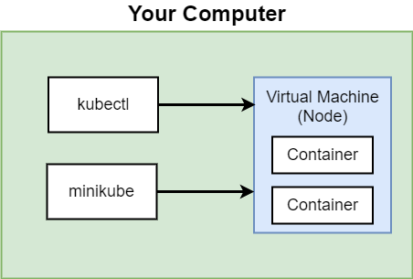

1. For Development, we use minikube
   - Much smaller than a production version
   - Using kubectl to manage containers in node
   - Using minkube for managing vm itself
1. With Docker for Windows, we will be using the built in k8s piece of that software
   - Don't need minikube
   - Will be using 'localhost' instead of ip address
1. For Production, Amazon: EKS
   - Can set up your own k8s cluster

## Kubernetes vs Docker Compose

### Docker Compose

1. Each entry can optionally get docker-compose to build an image
1. Each entry represents a container we want to create
1. Each entry defines the networking reqs (ports)

### Kubernetes

[Official Documentation](https://kubernetes.io/)

1. k8s expects all images to already be built
1. One config file per object we want to create
1. We have to manually set up all networking

### How to Deploy Multi-Container App

1. Make sure our image is hosted on docker hub
1. Make one config file to create the container
1. Make one config file to set up networking

## k8s Configuration File: Pod

```yaml
apiVersion: v1
kind: Pod
metadata:
  name: client-pod
  labels:
    component: web
spec:
  containers:
    - name: client
      image: eventhorizn/multi-client
      ports:
        - containerPort: 3000
```

1. A configuration file is used to create an 'Object'
   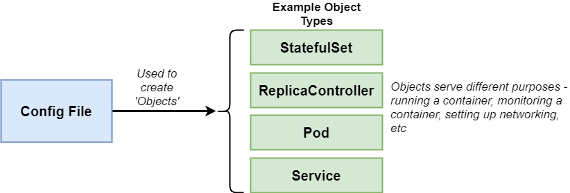
1. An API Version defines a different set of 'objects' we can use
   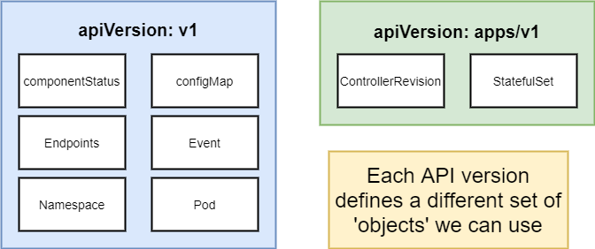
1. What's a Pod?
   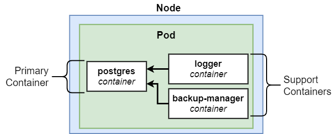
   - In k8s you can't run an image in a cluster
   - You must deploy a container in a Pod
   - You must depoy 1 or more containers in a Pod
   - Containers should serve a similar purpose!

## k8s Configuration File: Service

```yaml
apiVersion: v1
kind: Service
metadata:
  name: client-node-port
spec:
  type: NodePort
  ports:
    - port: 3050
      targetPort: 3000
      nodePort: 31515
  selector:
    component: web
```

1. What's a Service?
   - Sets up networking in a k8s cluster
   - ClusterIP, NodePort, LoadBalancer, Ingress
     - Types of services
1. NodePort exposes a container to the outside workd
   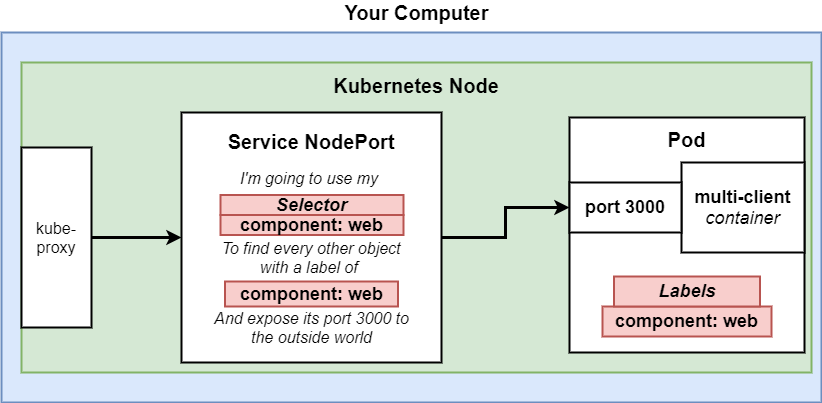
   - Only good for dev purposes (for the most part)
   - We use a label/connector design to hook up a Pod to a Service
   - selector > component > web connects to labels > component > web
   - With Docker Desktop, you use localhost:NodePort to access

## k8s Commands

1. Feed config to kubectl
   ```
   kubectl apply -f <filename>
   ```
1. Get status of running pods
   ```
   kubectl get pods
   ```
1. Get status of running services
   ```
   kubectl get services
   ```
1. Updating an object
   - Update the config file
   - Usually pointing to new image
   ```
   kubectl apply -f <filename>
   ```
   - This is the declarative approach!
1. Get detailed info about an object
   ```
   kubectl describe <object type> <object name>
   ```
   - Use after updating an object to confirm it worked
1. Deleting a pod
   ```
   kubectl delete -f <config file>
   ```
   - This is an imperative update...which yea, sometimes we gotta go imperative
1. With deployments you can get pods and deployments

   ```
   kubectl get deployments

   kubectl get pods
   ```

1. Update Image

   ```
   kubectl set image <object type>/<object name> <container name>=<new image>

   kubectl set image deployment/client-deployment client=eventhorizn/multi-client:v5
   ```

## Important Takeaways

1. k8s is a system to deploy containerized apps
1. **Nodes** are individual machines (or vms) that run containers
1. **Masters** are machines (or vms) with a set of programs to manage nodes
1. k8s didn't build our images, it got them from somewhere else
1. k8s (the master) decided where to run each container
   - Each node can run a dissimilar set of containers
1. To deploy something, we update the desired state of the master w/ a config file
1. The master works constantly to meet your desired state
1. k8s can do things imperitavely or declaratively
   - Try to do things declaratively

## Making Updates

1. In general, we want to use the declarative approach
1. That means updating the configuration file and re-feeding kubectl
1. There are limitations
   - For instance, can't update the port!
1. The issue is that we are using Pods object type
1. Use Deployment object
   - Maintains a set of identical pods ensuring that they have the correct config and that the right number exists
   - Very similar to a Pod

### Pods vs Deployment

#### Pods

1. Runs a single set of containers
1. Good for one-off dev purposes
1. Rarely used in production

#### Deployment

1. Runs a set of identical pods (one or more)
1. Monitors the state of each pod, updating as necessary
1. Good for dev
1. Good for production
1. So, in the instance of an update it can't do on an existing pod, it will delete and create a new pod

## Deployment Object

```yaml
apiVersion: apps/v1
kind: Deployment
metadata:
  name: client-deployment
spec:
  replicas: 1
  selector:
    matchLabels:
      component: web
  template:
    metadata:
      labels:
        component: web
    spec:
      containers:
        - name: client
          image: eventhorizn/multi-client
          ports:
            - containerPort: 3000
```

## Triggering a Deployment Update

1. You make a change to some code
1. You push a new image to Docker Hub
1. You want your k8s cluster to pull the latest image (automatically) and do a rolling update

This is quite difficult

1. The apply command in kubectl does **not** check for a new version of the image

### Options to Trigger Update

1. Manually delete pods to get deployment to recreate them w/ the latest version
   - Dangerous, could delete wrong set of pods
1. Tag built images w/ a real version number and specify that version in the config file
   - Actionable change for config file to rebuild
   - Adds an extra step in the prod deployment process
1. Use an imperative command to update the image version the deployment should use

   - Tag the image w/ a version
   - Manually update the image version the deployment should use
   - This is the approach we are going to use

   ```
   docker build -t eventhorizn/multi-client:v5 .

   docker push eventhorizn/multi-client:v5

   kubectl set image deployment/client-deployment client=eventhorizn/multi-client:v5
   ```

# Kubernetes Path to Production

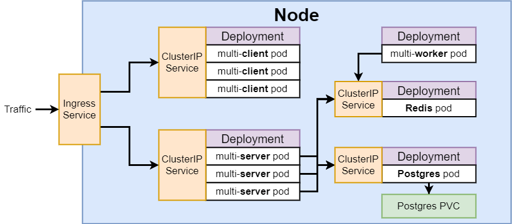

## ClusterIP vs NodePort Services

1. ClustIP exposes a set of pods to other objects in the cluster
   - NodePort exposes set of pods to outside world
1. Any object in Node can access any other object by it's ClusterIP service
   - If an object doesn't have this service, it is unreachable
1. You can create separate files for each service/object
1. Or combine them all into one/many
   - Maybe, deployment and ip service files should go together

## Applying Multiple Files

1. Deleting an old deployment (from above)
   - Cleanup
   ```
   kubectl get deployments
   ```
   ```
   kubectl delete deployment client-deployment
   ```
   ```
   kubectl get services
   ```
   ```
   kubectl delete service client-node-port
   ```
1. Applying group
   - Apply by directory
   ```
   kubectl apply -f k8s
   ```

## Combine Configuration Files

```yaml
apiVersion: apps/v1
kind: Deployment
metadata:
  name: server-deployment
spec:
  replicas: 3
  selector:
    matchLabels:
      component: server
  template:
    metadata:
      labels:
        component: server
    spec:
      containers:
        - name: server
          image: eventhorizn/multi-server
          ports:
            - containerPort: 5000
---
apiVersion: v1
kind: Service
metadata:
  name: server-cluster-ip-service
spec:
  type: ClusterIP
  selector:
    component: server
  ports:
    - port: 5000
      targetPort: 5000
```

1. We will be keeping the configuration files separate
   - Lets you know how many objects are in your Node
   - Allows you to know exactly which file has which configuration

## Volumes

1. Why do we need a Volume w/ Postgres?
   - If the pod that holds Postgres crashes, a new one is created
   - When that happens, all the data in the crashed pod is gone
1. Volume is on the host machine
   - Postgres 'thinks' it's writing to fs on container
1. Because of Volumes, scaling up a postgres pod w/ multiple images takes more configuration than increasing the replicas
1. A **Volume** in k8s is an object that allows a container to store data at the pod level

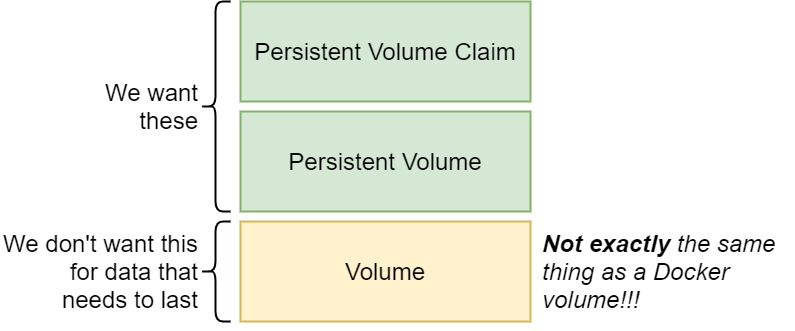

### Volumes vs Persistent Volumes

1. k8s volumes is pod based
   - Lifecycle: Pod is destroyed, so is volume
1. Persistent Volume is stored outside a pod
   - Lifecycle: 'lasts for all time'
   - Or someone deletes

### Persistent Volume vs Persistent Volume Claims

1. Persistent Volume Claim is an 'advertisement' of what's available
   - It's just an 'option'
1. When a pod requests a Claim, k8s will either use pre-built volumes, or build one if pod is requestsing something that isn't already built

## Persistent Volume Claim Configuration

```yaml
apiVersion: v1
kind: PersistentVolumeClaim
metadata:
  name: database-persistent-volume-claim
spec:
  accessModes:
    - ReadWriteOnce
  resources:
    requests:
      storage: 2Gi
```

1. Access Modes
   - ReadWriteOnce
     - Can be used by a single node
   - ReadOnlyMany
     - Multiple nodes can read from this
   - ReadWriteMany
     - Can be read and written to by many nodes
1. Storage location
   - Pretty obvious, but just your hardrive
   ```
   kubectl get storageclass
   ```
   ```
   kubectl describe storageclass
   ```
   - [Storage Class Options](https://kubernetes.io/docs/concepts/storage/storage-classes/)
1. Get Persistent Volumes
   ```
   kubectl get pv
   ```
   ```
   kubectl get pvc
   ```

## Environment Variables

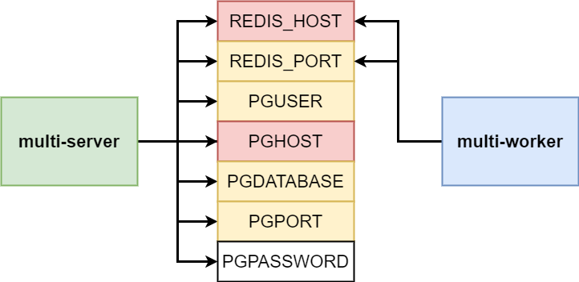

1. Red is a 'url' of sorts
   - How we connect to redis and postgres
1. Yellow are constant values
1. Password is different
   - We'll want to encode
1. Generating encoded secret

   ```
   kubectl create secret generic <secret-name> --from-literal key=value

   kubectl create secret generic pgpassword --from-literal PGPASSWORD=12345asdf
   ```

   ```
   kubectl get secrets
   ```
