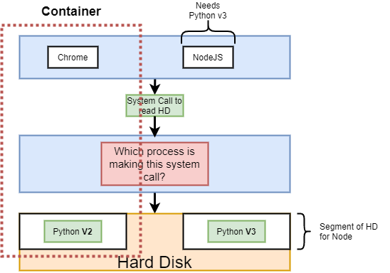

# Docker Bootcamp

## Getting Started

1. [Docker for Windows](https://docs.docker.com/docker-for-windows/install/)
1. Hello World
   ```cmd
   docker run hello-world
   ```
   - You don't have the hello-world image locally, so it reaches out to docker hub
     
1. How does it work on a system?
   

   - EVERY image is running on a linux VM

# Docker CLI

## Simple Hello World

```ps
docker run hello-world
```

## Command Override

1. Definition
   ```
   docker run <image-name> <command>
   ```
1. Print
   ```
   docker run busybox echo hi there
   ```
1. Listing unix folders inside a container
   ```
   docker run busybox ls
   ```
   - The echo commands exist inside the busybox image
   - They do NOT exist in the hello-world image
1. Doesn't work
   ```
   docker run hello-world echo hi
   ```
   - Commands are limited by the image

## List All Images on Machine

1. Command
   ```
   docker ps
   ```
1. Busybox and hello-world are in general short running containers
1. This will keep busybox running
   ```
   docker run busybox ping google.com
   ```
   ```
   docker ps
   ```
   
1. This is a good command to remember if you need to grab image ids

## List All Images Ever Created

1. Command
   ```
   docker ps --all
   ```
1. Which introduces the idea of a container life cycle
   - When does a container get shut down
   - Why does a container get shut down
   - What happens when it does

**docker run = docker create + docker start**

## Docker Create and Docker Start

1. Docker Create
   ```
   docker create hello-world
   ```
1. You'll get a long string like so:
   ```
   f7b241874c91443af5c22f3f4fd3de79e397ce4118c9c2d532d80adb33039cc9
   ```
   - Container id
1. Docker Start
   ```
   docker start -a f7b241874c91443af5c22f3f4fd3de79e397ce4118c9c2d532d80adb33039cc9
   ```
   - What does the `-a` get you?
   - Makes docker wait for output and prints it out to terminal
   - Docker start will not show you output by default
1. Restart a container
   ```
   docker run busybox echo hi there
   ```
   ```
   docker ps --all
   ```
   - Grab the id
   ```
   docker start -a <id>
   ```
   - You'll notice it showed 'hi t here'
   - You cannot replace the default command of a container once it's created
   - Can only start it and it will run that default command

## Clear Downloaded Containers

1. Show all containers
   ```
   docker ps --all
   ```
1. Remove all
   ```
   Docker system prune
   ```
1. Deletes cache as well as downloaded images
   - Will need to be re-cached (takes some time)

## Retrieving Log Outputs

1. Command
   ```
   docker logs <id>
   ```
1. Creating container to get logs
   ```
   docker create busybox echo hi there
   ```
   - Get the id
   ```
   docker start <id>
   ```
   ```
   docker logs <id>
   ```
1. Getting logs does NOT re-run the container
   - Simply gets all the logs emtted by the container
   - Much faster than re-running

## Stopping Containers

1. Create long running container
   ```
   docker create busybox ping google.com
   ```
   ```
   docker start <id>
   ```
1. See running image
   ```
   docker ps
   ```
1. So how do we stop this container?
1. Docker stop
   ```
   docker stop <id>
   ```
   - Gives the container 10 seconds to gracefully stop
1. Docker kill
   ```
   docker kill <id>
   ```
   - Shut down right now, no cleanup

## Multi Command Containers

1. The idea is that you will run containers that will have cli's within them
   - Servers, databases, etc
1. Redis is a server w/ it's own cli
   - You can run redis specific commands
1. Can we run this redis specific commands on a redis container?
   ```
   docker run redis
   ```
   - Eventually should see: `* Ready to accept connections`
1. How do we run commands in a container?
   ```
   docker exec -it <id> <command>
   ```
1. In a new terminal window
   ```
   docker exec -it <id> redis-cli
   ```
1. What is the `-it` flag
   - Two flags really, `-i` and `-t`
   - `-i` ties terminal to STDIN of image
   - `-t` makes input and output easy to read and gives 'intellisense'

## Getting Command Prompt In Container

1. Open a shell in a context of a container
   ```
   docker exec -it <id> sh
   ```
1. ctrl-c or ctrl-d to exit
   - I've found that ctrl-c does not kill the shell
1. Starting w/ a shell
   ```
   docker run -it busybox sh
   ```

# Building a Custom Image

## Docker Build

```Dockerfile
# Use an existing docker image as a base
FROM alpine

# Download and install a dependency
RUN apk add --update redis

# Tell the image what to do when it starts
# as a container
CMD [ "redis-server" ]
```


1. After building your custom Dockerfile

   - Open terminal in folder where Dockerfile exists

   ```
   docker build .
   ```

   - You'll get an id after creation

   ```
   docker run <id>
   ```

1. What is the `.`?
   - Build context
   - More to come
1. Big takeaway
   - Every step in the Dockerfile creates a temporary image
   - Runs a command in that image (an image can have only one default command)
   - Next step uses previous image as 'starting point'

## Rebuilds with Cache


1. If you rebuild a Dockerfile and it has steps that it's ran before, it will use the cache of the previous run
1. In the above image, step 3 is new, so it uses cache values for everything else
   - It will create new images from the introduction of the new instruction
   - This is true if you reorder steps!

## Tagging an Image

1. Needing to know the id of an image to run it is annoying
   ```
   docker build -t <dockerid>/<repo/project>:<version> .
   ```
   ```
   docker build -t eventhorizn/redis:latest .
   ```
   ```
   docker run eventhorizn/redis
   ```
1. The version at the end is the tag technically
1. Whole process is called tagging though

## Manual Image Generation with Docker Commit

1. You create a container from an image, but
1. You can also create an image from a container
   ```
   docker run -it apline sh
   ```
   ```
   /# apk add --update redis
   ```
   - Open a new terminal
   ```
   docker ps
   ```
   - Get id
   ```
   docker commit -c "CMD 'redis-server'" <id>
   ```
   ```
   docker run <new id>
   ```

# Making a Real Project

1. We first tried creating a docker image for node w/ just the 'alpine' image
   - But node and npm is not installed on it
1. The issue is that 'alpine' is a term in Docker for 'as small as possible'
1. The image we want to use is in the 'Node' repository
   - But we still want the 'alpine' tag
   - Because it's the smallest version of that image
1. Running the node image just w/ `docker run <id>` will not work
   - We need to do port forwarding
1. Port forwarding is only something we do when running a container
   ```
   docker run -p 8080:8080 <id>
   ```
   - Ports from and to do NOT have to be identical
   ```
   docker run -p 5000:8080 <id>
   ```
1. So, what happens when you update a file and want to reflect that change in an image?

   - We can't do hot reloading, so we have to rebuild the image
   - With node, in order to keep it from re-running npm install and re-installing all of your node packages

   ```
   FROM node:alpine

   WORKDIR /usr/app

   # Copy everything from local working directory to container's
   COPY ./package.json ./
   RUN npm install

   COPY ./ ./

   CMD ["npm", "start"]
   ```

   - We first copy the package.json
   - Then run the install
   - Then copy everything else
   - Will use the cache for package files

1. Separate out copy steps when you can so reloading is faster

# Docker Compose

1. Why would we need multiple containers that are part of the 'same app'
   - Node app in one container
   - Redis in another
1. All about scalability
   - If your app got popular, you'd want many images for your node server, and one for redis
1. This is why we wouldn't put node and redis in the same image!
   - All node images would point to same redis image
1. How do we connect two images together?
   - CLI has networking commands that are a pain to use
   - Docker Compose

## What is Docker Compoose?

1. Separate CLI that is installed w/ Docker
1. Used to start up multiple Docker containers at the same time
1. Automates some of the long-winded arguments we were passing to docker run
1. Wrapper on Docker CLI that simplifies things
1. Just by including your images in the same docker-compose file, they will be networked together
1. docker-compose.yml
   ```yml
   version: '3'
   services:
   redis-server:
     image: 'redis'
   node-app:
     build: .
     ports:
       - '4001:8081'
   ```

## Docker Compose Commands

1. Docker run myimage
   ```
   docker-compose up
   ```
1. Docker build . + docker run myimage
   ```
   docker-compose up --build
   ```
1. Stop Containers
   ```
   docker-compose down
   ```
1. Container Status
   ```
   docker-compose ps
   ```
   - Looks for Docker-compose.yml file
   - Will return status of images in that file
1. In general, you need to run docker compose commands w/i the directory w/ the docker-compose.yml file

## Restarting a container

1. Restart policies
   - "no"
     - Needs quotes
     - In yaml, no = false
   - always
   - on-failure
   - unless-stopped
1. In dockerfile
   ```yml
   version: '3'
   services:
   redis-server:
     image: 'redis'
   node-app:
     restart: always
     build: .
     ports:
       - '4001:8081'
   ```

# Create a Production Workflow

1. Create an app
   - [Link](https://create-react-app.dev/docs/getting-started/#npx)
   - Creating 'frontend' app
1. Create a dev dockerfile
   - Dockerfile.dev
   - How to run build on this file?
   ```ps
   docker build -f Dockerfile.dev
   ```
1. Running the react image
   ```ps
   docker run -p 3000:3000 IMAGE_ID
   ```
1. Back to the issue of propogating code changes to our container
   - Docker Volumes
   - We set up a 'reference' to our source code instead of copying
   ```
   docker run -p 3000:3000 -v /app/node_modules -v $(pwd):/usr/app <id>
   ```
   - -v /usr/app/node_modules
     - Needed as there's no node_modules on local machine to map to
   - $(pwd) = present working directory
     - Map pwd to /usr/app
     - Colon says 'map something outside container to something inside'
1. I was runningn issues running the Docker commands

## Using Docker Compose

```yml
version: '3'
services:
  web:
    stdin_open: true
    environment:
      - CHOKIDAR_USEPOLLING=true
    build:
      context: .
      dockerfile: Dockerfile.dev
    ports:
      - '3000:3000'
    volumes:
      - /app/node_modules
      - .:/app
```

1. Much easier to define what's happening
1. I actually worked when the docker commands above didn't
1. Should we keep the copy in the Dockerfile?
   - It's best to keep it even if we are referencing the files on the local machine and not the container

## Attaching Test Suite

1. There are two options
1. First is to run the docker image above and do a `docker exec` command to attach another docker image to it
1. The second is to create a new environment on the docker compose file to run tests
   - No interaction (which is fine)

```yml
version: '3'
services:
  web:
    stdin_open: true
    environment:
      - CHOKIDAR_USEPOLLING=true
    build:
      context: .
      dockerfile: Dockerfile.dev
    ports:
      - '3000:3000'
    volumes:
      - /app/node_modules
      - .:/app
 tests:
    stdin_open: true
    build:
      context: .
      dockerfile: Dockerfile.dev
    volumes:
      - /app/node_modules
      - .:/app
    command: ['npm', 'run', 'test']
```
