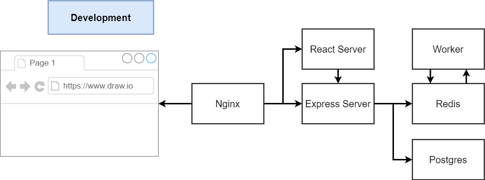
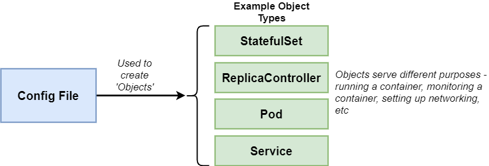
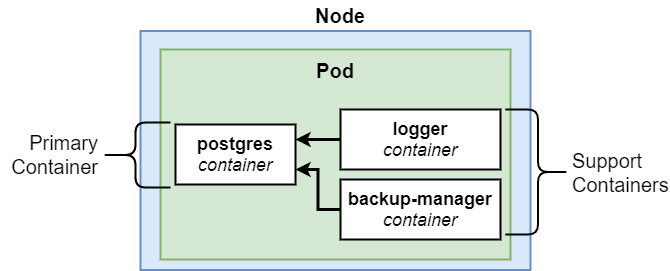

# Walkthrough

1. Show Docker for Windows
1. Docker CLI
   - How to run images
   - run, create, start, stop, kill
   - Run commands when you run an image
     - Image limits commands
   - List Images
   - -it flag
1. Custom Image
1. Make a 'real' project
1. docker-compose simple
   - Port forwarding is annoying, this makes it easier
   - Eventually will make running multiple containers easier too
1. docker-compose Multi-container app
   - Show app organization

# Docker CLI

1. docker run = docker create + docker start
   ```
   docker run hello-world
   ```
1. Docker create + docker run
   ```
   docker create hello-world
   ```
   ```
   docker start -a <id>
   ```
   - Hello world is a short lived container, there and gone
   - `-a` prints output to terminal
1. Longer running container
   ```
   docker run busybox ping google.com
   ```
   - Great example of passing a command into an image!
1. Killing an image
   ```
   docker ps
   ```
   - Get list of running containers
   ```
   docker stop <id>
   ```
   ```
   docker kill <id>
   ```
1. Getting shell in an image
   ```
   docker run -it busybox sh
   ```
   - it flag
     - `-i` ties terminal to STDIN of image
     - `-t` makes input and output easy to read and gives intellisense
   - ctrl-c doesn't get me out, I always have to ctrl-d

# Create Custom Image

1. Show Dockerfile for redis
1. Run the below command
   ```
   docker build .
   ```
1. You'll get an id after building
   ```
   docker run <id>
   ```
1. The '.' is the build context
   - Where should it look for a docker file?
1. Tagging an image
   - Hate the ids?
   ```
   docker build -t eventhorizn/redis:latest .
   ```
   - Convention is to tag images w/ your docker id
1. Big takeaways
   - When you have multiple 'steps' to build an image (think, build this image, copy files from local to image, etc), it makes intermediate images
   - An image can only have one default command

# Making a Real Project

1. Show node project
   - Very simple, just an index
   - Show dockerfile
   - node:alpine
1. Notice steps in docker file
   - Copy package.json to image
   - Run npm install
   - Then copy other files
   - This allows us to make a change to a file, rebuild the image more quickly
1. We also have to rebuild the container every time we make a code change
   - We can fix that
1. Build the project
   ```
   docker build -t eventhorizn/realproj .
   ```
1. Port forwading

   ```
   docker run -p 8080:8080 eventhorizn/realproj
   ```

   - Ports don't have to be identical

1. Make a change to index and rebuild image, then re-run
   - Kill running image first

# Docker Compose Simple

1. Show app
   - We technically are running one image w/ redis and node/express
   - In the future we will separate these out
1. Notice I haven't installed npm packages!
   - This is all done in the container, not locally
1. Build image
   ```
   docker-compose up
   ```
   - We are on port 4001, just to show they don't need to be the same
1. Do a quick show on the production app in 05
   - Just docker-compose it, maybe chat quickly about pushing to Elastic Beanstalk
   - Show some of the travis
1. Ok, but how do we develop w/ docker. I don't want to have to rebuild every time I need to make a change
   - We set up a 'reference' to our source code instead of copying
   ```
   docker run -p 3000:3000 -v /app/node_modules -v $(pwd):/usr/app <id>
   ```
   - But it's much easier w/ docker compose
   - Show the volumes section
   - Then show making a change

# Docker-Compose Multi Container



1. In terms of 'things learned' this one isn't very different than what we've learned already
   - This is just to show you why docker-compose is so powerful
1. All the images in docker-compose can talk to each other
   - Don't need any specific security setup
   - Go through docker-compose and aws.json
1. Explain how app works quickly
   - Over architected to show how many images can play nice

# Kubernetes!

## Docker Compose

1. Each entry can optionally get docker-compose to build an image
1. Each entry represents a container we want to create
1. Each entry defines the networking reqs (ports)

## Kubernetes

[Official Documentation](https://kubernetes.io/)

1. k8s expects all images to already be built
1. One config file per object we want to create
1. We have to manually set up all networking

# k8s Configuration File: Pod

```yaml
apiVersion: v1
kind: Pod
metadata:
  name: client-pod
  labels:
    component: web
spec:
  containers:
    - name: client
      image: eventhorizn/multi-client
      ports:
        - containerPort: 3000
```

1. A configuration file is used to create an 'Object'
   
1. An API Version defines a different set of 'objects' we can use
   
1. What's a Pod?
   
   - In k8s you can't run an image in a cluster
   - You must deploy a container in a Pod
   - You must depoy 1 or more containers in a Pod
   - Containers should serve a similar purpose!
1. Just go over how we have to set things up w/ k8s
   
   - Unlike in docker-compose, deployment objects can't talk to each other
   - You have to set up ClusterIP Services
     - Another type of object
     - Used to determine how each deployment communicates
   - Notice the organization
     - Node > Deployment > Pods (Can have one or many Images)
1. Go over some of the yaml files
   - There's one per object
   - You can combine, but it's better to keep separate
1. We are using an outside package for ingress
   - You need to define a way for the outside world to get into your node
   - Using ingress-nginx
1. Also had to create a kubernetes secret for the postgres password
1. Finally
   ```
   kubectl apply -f k8s
   ```
